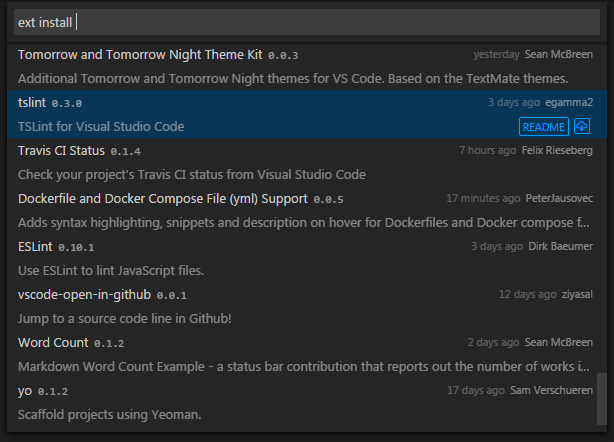

# View in Default Application Extension

> This extension is based on the original [view-in-browser](https://github.com/hellopao/view-in-browser) extension written by [hellopao](https://github.com/hellopao). I forked this extension and added additional commands.

This extension will allow you to view any HTML page in your operating system's default browser.

## Install

You can browse and install this extension from within VS Code. Press ``F1`` and narrow down the list commands by typing ``extension``:

Select the ``Extensions: Install Extension`` command.

> **Tip:** As an alternative, press ``Ctrl+P`` and type ``ext install`` with a trailing space.

You will now see a list of extensions available in the gallery:

Search for this extension by typing in the text ``view in default application``:

Once installed, you will be prompted to restart your instance of Visual Studio Code to use the extension:

## Using the Extension

You can use the extension either by invoking the ``View in Default Application`` command using the ``F1`` shortcut key:

Or by using the following keybindings:

| OS | Keybinding |
| --- | --- |
| Windows/Linux | ``ctrl+k ctrl+b`` |
| OSX | ``cmd+k cmd+b`` |
